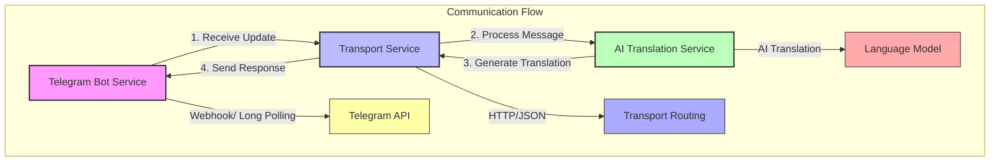

Структура:
```md
AI-SmartTranslate-Hub/
│
├── telegram_bot_service/          # Сервис Telegram бота
│   ├── config/
│   │   └── settings.py
│   ├── src/
│   │   ├── handlers/
│   │   │   ├── start_handler.py
│   │   │   └── message_handler.py
│   │   ├── clients/
│   │   │   └── transport_client.py
│   │   ├── routes/
│   │   │   └── translation_route.py
│   │   └──telegram_bot.py
│   ├── .env
│   ├── requirements.txt
│   ├── Dockerfile
│   ├── main.py
│   ├── logs/
│   │   └── telegram_bot_service.log
│   └── venv/...
│
├── translation_service/            # Сервис перевода
│   ├── config/
│   │   └── settings.py
│   ├── src/
│   │   ├── providers/
│   │   │   ├── __init__.py
│   │   │   ├── base_provider.py
│   │   │   └── gpt_translator.py
│   │   ├── translation/
│   │   │   └── translator.py
│   │   ├── models/
│   │   │   └── translator.py
│   │   ├── routes/
│   │   |   └── translate_route.py
│   │   └── clients/
│   │       └── transport_client.py
│   ├── logs/
│   │   └── translation_service.log
│   ├── .env
│   ├── requirements.txt
│   ├── Dockerfile
│   ├── main.py
│   └── venv/...
│ 
├── transport_service/             # Центральный сервис коммуникации
│   ├── config/
│   │   └── settings.py
│   ├── logs/
│   │   └── transport_service.log
│   ├── src/
│   │   ├── routes/
│   │   │   └── communication_route.py
│   │   ├── models/
│   │   │   └── message.py
│   │   └── handlers/
│   │       └── message_router.py
│   ├── main.py
│   ├── Dockerfile
│   ├── requirements.txt
│   └── venv/...
logging_service/
├── Dockerfile
├── requirements.txt
├── static/
├── templates/
│   └── logs.html         # Веб интерфейс логов
├── src/
│   ├── main.py           # Основной сервис
│   ├── schemas.py        # Модели данных
│   ├── storage.py        # Абстракция хранения логов
│   └── handlers.py       # Обработчики логов
└── docker-compose.yml


├── middleware_logging/             # Центральный сервис сбора логов
│   ├── tests/
│   │   ├── __init__.py
│   │   └── test_middleware.py
│   ├── logs/
│   │   └── transport_service.log
│   ├── src/
│   │   ├── middleware.py
│   │   ├── main.py
│   │   └── __init__.py
│   ├── README.md
│   └── requirements.txt
├── .env
├── .env.example
├── .gitignore
└── docker-compose.yml              # Общий compose для всех сервисов
```


│
│СТАРОЕ
├── transport_service/             # Новый сервис транспорта
│   ├── config/
│   │   └── settings.py
│   ├── src/
│   │   ├── providers/             # Провайдеры перевода
│   │   │   ├── __init__.py
│   │   │   ├── base_provider.py
│   │   ├── router/
│   │   │   └── translation_router.py
│   │   └── models/
│   │       └── translation.py
│   ├── .env
│   ├── requirements.txt
│   ├── Dockerfile
│   └── main.py
├── .env
├── .env.example
├── .gitignore
└── docker-compose.yml              # Общий compose для всех сервисов


подход устраивает

запускаю для каждой службы свой терминал.
в каждом термииналенастраиваю своё виртуальное окружение и устанавливаю зависимости:
```bash
clear
python3 -m venv venv
source venv/bin/activate
clear
python main.py
# Устанавливаем зависимости
pip install --upgrade pip
pip install -r requirements.txt
```
Я заметил, что мы пока не реализовари работу с секретами.
Я уже скопировал старые .env
теперь необходимо внести соотвествующие изменения в конфигах и в остальных зависимых от этих переменных файлах.

Запуск каждой службы как происходит?
просто 
```bash
python main.py
```
или есть какие-то особенности?


Я заметил, что мы снова начинаем работу по схеме, когда бот будет обзаться с сервисом перевода, а сервис транспорта не задействован.
Необходимо реализовать модель, в которой все сервисы обща.тся только с транспортным сервисом


Общая логика взаимодействия
Вебхук Telegram: Бот работает как вебхук, который принимает сообщения от пользователей.
Запрос на перевод: Когда пользователь отправляет текст для перевода, бот отправляет запрос в транспортный сервис.
Обработка в транспортном сервисе: Транспортный сервис получает запрос и направляет его в сервис перевода.
Перевод текста: Сервис перевода обрабатывает запрос, выполняет перевод и отправляет результат обратно в транспортный сервис.
Ответ пользователю: Транспортный сервис возвращает результат перевода обратно в бот, который отправляет его пользователю в чате Telegram.


Я сейчас переделаю все config.py
telegram_bot_service
```telegram_bot_service/config/settings.py
from pydantic_settings import BaseSettings, SettingsConfigDict
from dotenv import load_dotenv

load_dotenv()

TELEGRAM_BOT_TOKEN = os.getenv('TELEGRAM_BOT_TOKEN')
TRANSPORT_SERVICE_URL = os.getenv('TRANSPORT_SERVICE_URL')

# Настройки логирования
LOG_LEVEL = os.getenv('LOG_LEVEL', 'INFO')

class Settings(BaseSettings):
    TELEGRAM_BOT_TOKEN: str
    TRANSLATION_SERVICE_URL: str
    LOG_LEVEL: str = "INFO"

    model_config = SettingsConfigDict(
        env_file=".env", 
        env_file_encoding="utf-8"
    )

settings = Settings()
```

```translation_service/config/settings.py
from pydantic_settings import BaseSettings, SettingsConfigDict
import os

load_dotenv()

TRANSPORT_SERVICE_URL = os.getenv('TRANSPORT_SERVICE_URL')
OPENAI_API_KEY =  os.getenv('OPENAI_API_KEY')

class Settings(BaseSettings):
    OPENAI_API_KEY: str
    LOG_LEVEL: str = "INFO"
    HOST: str = "0.0.0.0"
    PORT: int = 8000

    model_config = SettingsConfigDict(
        env_file=".env", 
        env_file_encoding="utf-8"
    )

settings = Settings()

# Настройки логирования
LOG_LEVEL = os.getenv('LOG_LEVEL', 'INFO')
```

```transport_service/config/settings.py
Обнаружил отсуствие этого файла
```

